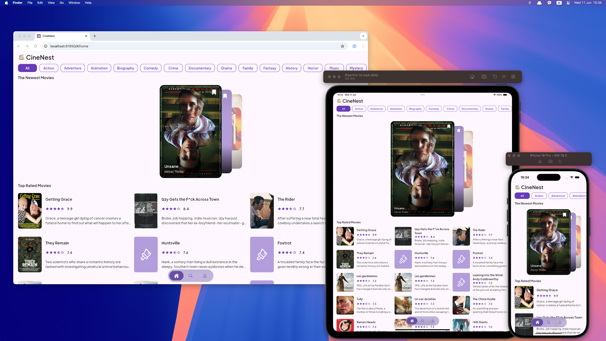
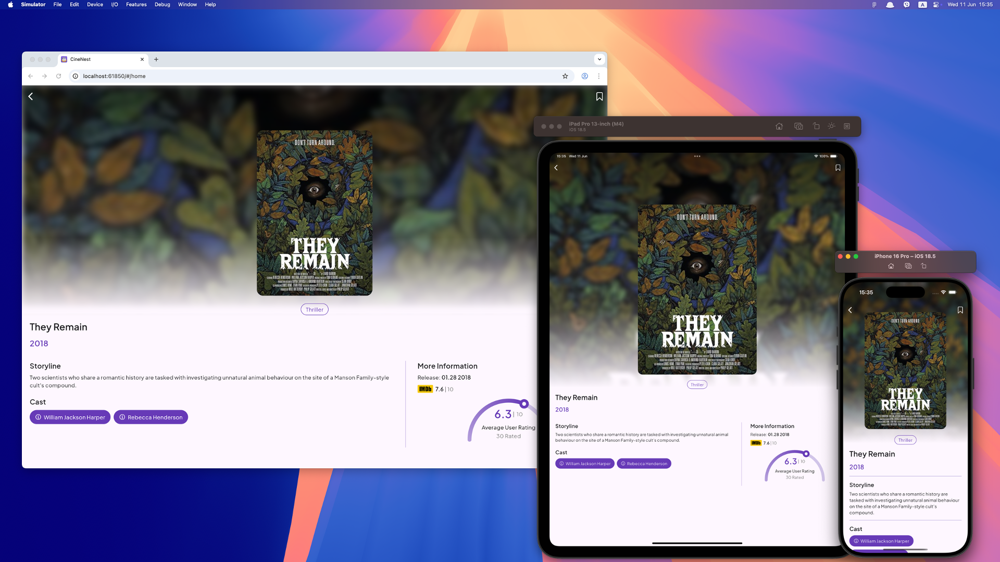
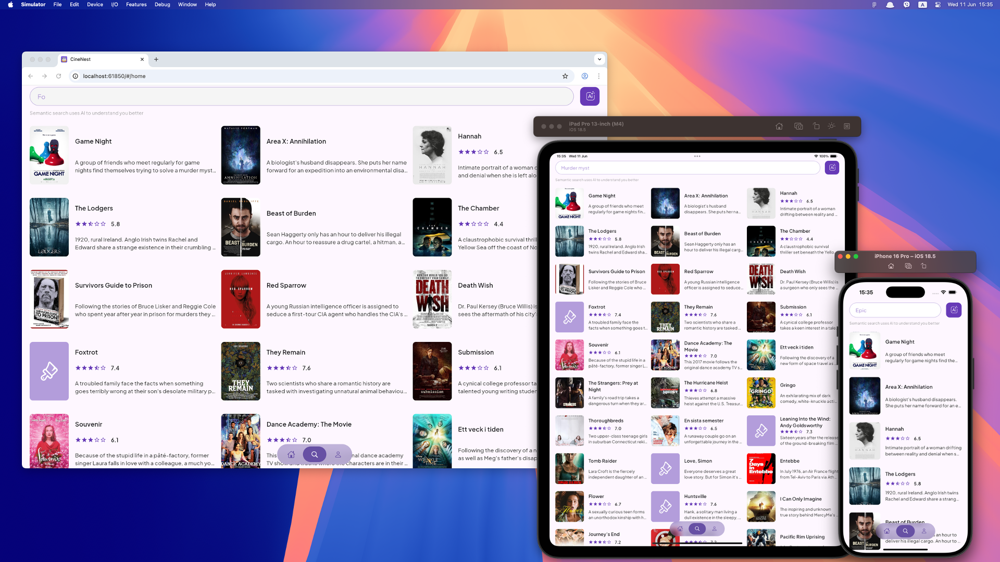
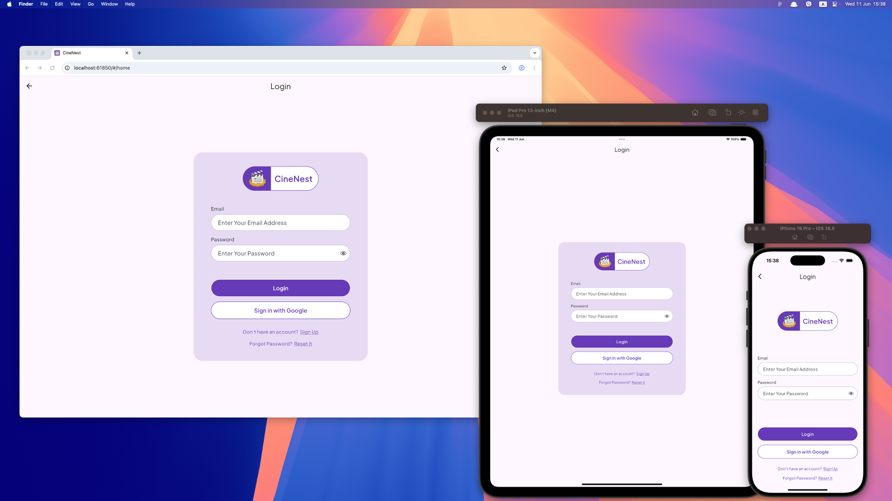

# CineNest

**CineNest** is a cross-platform mobile and web application built with **Flutter**, designed to help users seamlessly discover, search, and bookmark movies. It supports offline browsing, real-time sync across devices, and offers both keyword and AI-powered semantic search — all wrapped in a clean, custom UI.

---

## ✨ Features

- **Splash Screen** — Animated, branded entry point.
- **Fully Functional Onboarding** — Smooth sign-up with email/password or Google login.
- **Home Screen**
  - Browse movies without registration.
  - Filter by genre.
  - Offline-first: movies are cached on first load and browsable without internet.
- **Search Tab**
  - **Keyboard Search**: case-sensitive, instant results using local data.
  - **AI Search**: semantic search powered by embeddings via Meilisearch (hosted on Google Cloud VM).
- **Movie Details Screen**
  - View complete movie info in a clean custom layout.
  - Tap actor names to open their Wikipedia pages.
- **Bookmarking**
  - Save favorites (requires login).
  - Real-time sync across devices via Firestore listeners.
- **Profile Management**
  - Edit profile details (name, avatar, etc.).
  - Avatar photo is stored in Firebase Storage.
  - On first login, a Firebase Cloud Function creates a user DB record.
  - All profile actions reflect instantly across signed-in devices.
- **404 Screen** — Friendly fallback for missing or broken pages.

---

## 🧠 Highlights

- Blazingly fast **offline experience** via local storage.
- **AI search engine** delivers smarter results based on meaning, not just keywords.
- Clean, **responsive UI**, entirely custom-built with attention to detail.
- **Real-time syncing** for seamless multi-device use.

---

## 🚀 Technologies Used

- **Flutter** (Mobile + Web)
- **Dart**
- **Firebase Authentication** (Email/Password + Google Sign-In)
- **Firebase Firestore** (for real-time bookmarks & user sync)
- **Firebase Cloud Functions** (to create user DB entries on first login)
- **Firebase Storage** (to store user avatars)
- **Meilisearch** (AI semantic search engine, hosted on Google Cloud VM)
- **REST API** for movie data:
  ```
  https://raw.githubusercontent.com/FEND16/movie-json-data/master/json/movies-coming-soon.json
  ```

---

## 🔧 Installation

```bash
# Clone the repository
git clone https://github.com/aleksandarch/CineNest.git
cd cinenest

# Install dependencies
flutter pub get

# Run on mobile
flutter run

# Run on web
flutter run -d chrome
```

---

## 📸 Screenshots

### Home Screen


### Movie Details


### Search (Keyboard vs AI)


### Login


---

## 👤 Author

**Aleksandar Chervenkov**